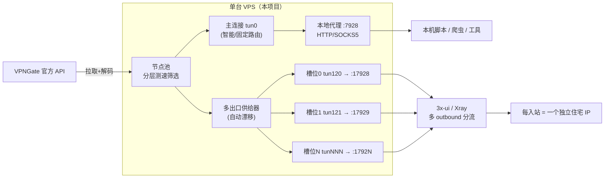

# AimiliVPN · 多出口增强版 (Multi-Exit Edition) 🌐

[](https://www.python.org/)
[](#)
[](#)
[](./LICENSE)

Bilingual: [中文](#中文) | [English](#english)

---

<a name="中文"></a>
## 中文

**AimiliVPN 多出口增强版** 是一个基于官方 VPNGate 开放协议的、**零第三方依赖（纯 Python 标准库）** 的高性能 VPN 代理网关。在上游能力（智能并发测速、多路由模式、暗黑玻璃拟物管理网页、实时日志、故障自愈）之上，本二开版本新增并强化了以下能力：

- 🌟 **多出口住宅 IP（Multi-Exit）**：单台服务器上同时维持 **N 条相互隔离的隧道**，每条连接不同住宅节点、绑定独立本地代理端口，**专为配合 3x-ui / Xray 实现「每个入站走一个独立住宅 IP」**，并可一键导出 Xray 出站配置。
- ⚡ **分层并发测速**：先用高并发 TCP 连通性粗筛淘汰死节点，再对存活节点做完整 OpenVPN 精验，大批量检测更快、更省资源。
- 🧠 **代理链路优化**：隧道内 DNS 解析加入缓存与多上游 DNS 竞速；本地代理转发改为非阻塞双向泵，修复了原半双工阻塞风险并支持半关闭传播。
- 🛡️ **多出口可靠性**：供给器非阻塞互斥避免并发重入，进程重启时自动回收遗留隧道孤儿进程。

> 🔱 **二次开发声明**：本仓库基于上游原项目 [baoweise-bot/aimili-vpngate](https://github.com/baoweise-bot/aimili-vpngate) 二次开发（Fork），保留其全部原有能力。原项目版权归原作者所有，在此向上游致谢。本仓库仅维护本二开版本的新增特性与适配。完整改动见 [CHANGELOG.md](./CHANGELOG.md)。

---

### 🚀 一键部署（Debian / Ubuntu / CentOS / RHEL / Rocky / Alma / Fedora / Alpine 等）

在你的 Linux VPS 上以 root 执行：

```bash
bash <(curl -Ls https://raw.githubusercontent.com/Guli-Joy/aimili-vpngate/main/install.sh)
```

> 💡 安装脚本会自动识别包管理器（apt/apk/dnf/yum）安装依赖（openvpn、python3、iproute2、iptables 等）、注册系统服务（systemd 或 OpenRC）、生成随机管理员账号密码与带安全后缀的后台地址，并安装交互式命令行菜单 `ml`。部署完成后终端会打印专属后台链接，如 `http://你的IP:8787/u71e9IXp4TPx`。

如需指定自定义仓库（例如你自己的二开分叉）：`bash install.sh <github_user> <repo_name>`。

---

### ⭐ 核心特性

| 能力 | 说明 |
| --- | --- |
| 零依赖 | 纯 Python 标准库实现，无需 pip 安装任何三方包 |
| 节点来源 | 实时拉取官方 VPNGate iPhone API，自动解码 OpenVPN 配置 |
| 智能测速 | **分层测速**：TCP 粗筛 + OpenVPN 精验，并发可配置 |
| 路由模式 | 智能自动漂移 / 固定 IP / 固定国家地区 / 收藏夹优先 |
| 出站类型过滤 | 可只选住宅/移动 IP，或机房 IP |
| 本地代理网关 | 自适应 HTTP + SOCKS5（默认端口 `7928`，默认仅绑 `127.0.0.1`） |
| **多出口住宅 IP** | **N 条隔离隧道 + N 个独立代理端口 + 自动漂移 + 3x-ui 一键导出** |
| 诊断引擎 | API/OpenVPN/本地路由防火墙分级错误码与中文原因定位 |
| 管理后台 | 暗黑玻璃拟物风网页 + 随机安全后缀 + 会话鉴权 |
| 命令行 | `ml` 交互式菜单（状态自检、服务管理、更新等） |

---

### 🏗️ 架构示意



每个出口槽位通过把出站 socket 绑定到各自的 `tunN`（`SO_BINDTODEVICE`）+ 独立策略路由表实现彼此隔离，互不串流。

---

### 💡 快速使用

#### 第一步：登录后台
浏览器打开部署时输出的专属地址（含安全后缀）即可进入管理界面。

#### 第二步：获取并连接节点
首次进入会自动测速拉取。点击 **更新节点** 触发并发测速，再选择出站路由模式：
- **智能自动配置**（推荐）：节点失效时数秒内自动漂移到其他健康节点。
- **固定国家地区**：只选指定国家（如 JP、KR、US）最佳节点。
- **固定 IP 节点**：锁定单一节点。

#### 第三步：使用本机代理（核心）
为防止端口被公网滥用扫描，双效代理（默认 **`7928`**，自适应 SOCKS5 / HTTP）**默认仅绑定 `127.0.0.1`**，只接收 VPS 本机流量。

```python
import requests
proxies = {"http": "http://127.0.0.1:7928", "https": "http://127.0.0.1:7928"}
print(requests.get("https://api.ipify.org", proxies=proxies).text)
```

```bash
export http_proxy="http://127.0.0.1:7928"
export https_proxy="http://127.0.0.1:7928"
```

> 💡 确需对公网开放代理端口，可设环境变量 `export LOCAL_PROXY_HOST="::"` 后重启服务。

---

### 🌐 多出口住宅 IP（本版本核心特性）

在一台服务器上同时建立 **N 条相互隔离的 VPN 隧道**，每条连接不同住宅节点、绑定独立本地代理端口，配合 3x-ui / Xray 实现「每个入站走一个独立住宅 IP」。

**工作原理**：每个出口槽位 = 独立 `tunN` 隧道 + 独立策略路由表 + 独立本地 SOCKS5/HTTP 代理端口（默认从 `17928` 起递增）。各槽位互不影响；节点掉线会**自动漂移**补齐其他健康住宅节点。

**使用步骤**：
1. 进入后台 → **管理员 → 多出口住宅 IP**。
2. 设置「出口数量」（如 `5`）、可选「国家过滤」（如 `JP,KR`）、勾选「仅住宅 IP」。
3. 点击 **应用**，系统自动拉起 N 条隧道，代理端口为 `17928, 17929, ...`。
4. 点击 **导出 3x-ui 配置**，把生成的 `outbounds` 合并进 Xray 配置，并将 `routing.rules` 里的 `inboundTag` 改成你实际的入站标签。

**3x-ui / Xray 出站示例**（即导出内容的结构）：

```json
{
  "outbounds": [
    { "tag": "res-0-jp", "protocol": "socks", "settings": { "servers": [{ "address": "127.0.0.1", "port": 17928 }] } },
    { "tag": "res-1-jp", "protocol": "socks", "settings": { "servers": [{ "address": "127.0.0.1", "port": 17929 }] } }
  ],
  "routing": {
    "rules": [
      { "type": "field", "inboundTag": ["inbound-0"], "outboundTag": "res-0-jp" },
      { "type": "field", "inboundTag": ["inbound-1"], "outboundTag": "res-1-jp" }
    ]
  }
}
```

> ⚠️ **关于住宅 IP 数量**：VPNGate 同时可用的健康住宅节点有限（以日韩居多），实际能填满的槽位数受当下节点池限制。若需要大规模、稳定且可锁定的住宅 IP，建议叠加付费住宅代理（用法与上面相同，只是把上游换成代理商地址 + 每个 outbound 用不同 username 触发粘性会话）。

**真机自检**：部署后可在 VPS 上运行自检脚本，逐槽核对 tun 设备、策略路由、端口监听与真实出口 IP：

```bash
bash scripts/selfcheck_multiexit.sh
```

---

### ⚙️ 可调环境变量（节选）

| 变量 | 默认 | 说明 |
| --- | --- | --- |
| `LOCAL_PROXY_HOST` | `127.0.0.1` | 本地代理绑定地址（设 `::` 可对公网开放） |
| `LOCAL_PROXY_PORT` | `7928` | 主代理端口 |
| `UI_PORT` | `8787` | 管理后台端口 |
| `OPENVPN_TEST_CONCURRENCY` | `8` | OpenVPN 精验并发数 |
| `TCP_PRESCREEN_CONCURRENCY` | `100` | TCP 粗筛并发数 |
| `MAX_EXIT_SLOTS` | `16` | 多出口槽位上限 |
| `MULTI_EXIT_SLOTS` | `0` | 启动默认槽位数（0=关闭，亦可在后台调整） |
| `SLOT_PORT_BASE` | `17928` | 多出口代理端口基准 |
| `SLOT_PROXY_HOST` | `127.0.0.1` | 多出口代理绑定地址（默认仅回环，与主代理解耦，**不建议**公网暴露） |
| `SLOT_DEV_BASE` | `120` | 多出口 tun 设备基准号 |
| `SLOT_TABLE_BASE` | `200` | 多出口策略路由表基准 |
| `EXIT_SLOTS_CHECK_INTERVAL` | `30` | 多出口体检/补齐间隔（秒） |
| `OPENVPN_TUN_DNS` | `8.8.8.8,1.1.1.1` | 隧道内 DNS（逗号分隔，竞速） |

---

### ⚠️ 常见问题 (FAQ)

**1. 提示 `Cannot allocate tun` / `Cannot open tun/tap dev`**
VPS 未启用虚拟网卡（常见于 LXC/OpenVZ）。请在服务商控制面板开启 **TUN/TAP** 后重启，或工单联系客服。

**2. 后台打不开（超时/拒绝连接）**
- 本机防火墙拦截：`ufw allow 8787/tcp && ufw allow 7928/tcp`（firewalld 用 `firewall-cmd --add-port=...`）。
- 云厂商安全组：在入站规则放行 TCP `8787`（后台）。注意多出口端口（`17928+`）默认仅本机使用，**无需**对公网放行。

**3. 提示 `API Domain Blocked` 且候选节点为 0**
DNS 污染或域名被拦截。可在「管理员 → 代理设置」配置上游代理拉取，或改 `/etc/resolv.conf` 为公共 DNS（`nameserver 8.8.8.8`）。

**4. VPN 已连但客户端走代理无流量**
部分系统严格反向路径过滤（`rp_filter`）误丢回包。在终端运行 `ml` 打开菜单，按提示把 `rp_filter` 修为宽松模式（值 `2`）。

---

<a name="english"></a>
## English

**AimiliVPN · Multi-Exit Edition** is a high-performance, **zero-dependency (pure Python stdlib)** VPN proxy gateway based on the official VPNGate protocol. On top of the upstream capabilities (concurrent benchmarking, multiple routing modes, a polished web UI, live logs, self-healing), this fork adds:

- 🌟 **Multi-Exit residential IPs**: run **N isolated tunnels on one server**, each on a different residential node bound to its own local proxy port — built to pair with **3x-ui / Xray** so each inbound egresses through a distinct residential IP, with one-click Xray outbound export.
- ⚡ **Layered benchmarking**: fast concurrent TCP pre-screen drops dead nodes before the expensive full OpenVPN verification.
- 🧠 **Proxy path improvements**: in-tunnel DNS caching + multi-resolver racing; the relay was rewritten as a non-blocking bidirectional pump (fixes half-duplex blocking, supports half-close).
- 🛡️ **Multi-exit reliability**: non-blocking supervisor mutex prevents re-entrancy; orphaned slot tunnels are reclaimed on restart.

> 🔱 **Fork notice**: This repository is a secondary-development (fork) of the upstream project [baoweise-bot/aimili-vpngate](https://github.com/baoweise-bot/aimili-vpngate), keeping all of its original capabilities. All credit for the original work goes to the upstream author; this repo maintains the fork's added features only.

### 🚀 One-Click Installation

Run as root on your Linux VPS:

```bash
bash <(curl -Ls https://raw.githubusercontent.com/Guli-Joy/aimili-vpngate/main/install.sh)
```

It auto-detects the package manager (apt/apk/dnf/yum), installs deps, registers a service (systemd/OpenRC), generates random admin credentials and a secret-suffixed UI URL, and installs the `ml` CLI. Copy the printed URL (e.g. `http://your_ip:8787/u71e9IXp4TPx`) to access the panel.

### 💡 Quick Start
1. Open the printed UI URL and log in.
2. Click **Update Nodes** to benchmark; pick a routing mode (Smart Auto / Fixed Region / Fixed IP).
3. Use the local proxy at `127.0.0.1:7928` (HTTP/SOCKS5, localhost-only by default).

### 🌐 Multi-Exit Residential IPs
Each exit slot = an independent `tunN` tunnel + dedicated policy routing table + dedicated local SOCKS5/HTTP port (from `17928`). Slots are isolated and auto-drift to healthy residential nodes when one dies.

- **Usage**: Web UI → **Admin → Multi-Exit Residential IP** → set slot count (e.g. `5`), optional country filter (`JP,KR`), residential-only toggle → Apply. Click "Export 3x-ui config" and merge the `outbounds` into your Xray config (change `inboundTag` to your real inbound tags).
- **Env vars**: `MAX_EXIT_SLOTS` (16), `SLOT_PORT_BASE` (17928), `SLOT_DEV_BASE` (120), `SLOT_TABLE_BASE` (200), `EXIT_SLOTS_CHECK_INTERVAL` (30s).

> ⚠️ VPNGate's pool of healthy residential nodes is limited (mostly JP/KR), so how many slots you can actually fill depends on the current pool. For large-scale, stable, pinnable residential IPs, layer in a paid residential proxy.

### ⚠️ Troubleshooting
- **`Cannot allocate tun`**: enable TUN/TAP in your VPS panel (common on OpenVZ/LXC).
- **UI unreachable**: allow TCP `8787` in OS firewall + cloud security group. Multi-exit ports (`17928+`) are localhost-only and need no public exposure.
- **`API Domain Blocked` / 0 nodes**: DNS poisoning — set an upstream proxy in Admin → Proxy Settings, or use public DNS in `/etc/resolv.conf`.
- **Connected but no traffic**: strict `rp_filter` dropping return packets — run `ml` and apply the loose-mode (`2`) fix.
